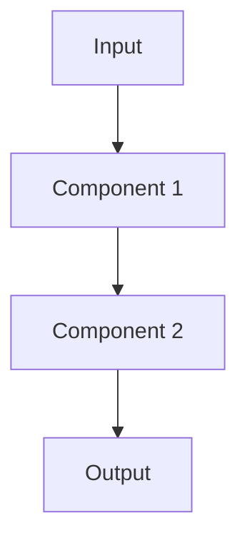

# Abstract

Write your abstract here (150–250 words). State the problem, method, and key quantitative results.

---

# Table of Contents

<!-- Auto-generated by Pandoc or rendered by GitHub/Obsidian -->

---

# 1. Introduction

## 1.1 Background

Body text. Inline math: $f(x) = \sum_{i=1}^{n} w_i x_i$. Citation: [@key2024].

## 1.2 Problem Statement

## 1.3 Contributions

1. First contribution.
2. Second contribution.
3. Third contribution.

---

# 2. Literature Review

## 2.1 Theme One

Synthesis of sources with comparison and contrast [@source1; @source2; @source3].

**Gap identified:** Current methods do not address X, which this thesis proposes to solve.

---

# 3. Methodology

## 3.1 Architecture Overview

## 3.2 Mathematical Formulation

Display equation:

$$
\mathcal{L} = \mathcal{L}_{\text{cls}} + \lambda \mathcal{L}_{\text{reg}}
$$

---

# 4. Experimental Setup

## 4.1 Datasets

| Dataset | Train | Val | Classes |
|---|---|---|---|
| COCO 2017 | 118,000 | 5,000 | 80 |

## 4.2 Evaluation Metrics

- mAP@0.5
- Precision, Recall, F1-score

---

# 5. Results and Discussion

## 5.1 Main Results

| Model | mAP@0.5 | mAP@0.5:0.95 | ΔmAP |
|---|---|---|---|
| Baseline | 56.3 | 40.1 | — |
| Proposed | 61.0 | 44.2 | +4.7 |

## 5.2 Ablation Study

---

# 6. Conclusion and Future Work

## 6.1 Conclusion

## 6.2 Future Work

---

# References

<!-- Auto-populated by Pandoc from references.bib -->

<!-- Compile with: pandoc thesis.md --citeproc --bibliography references.bib -o thesis.pdf -->
